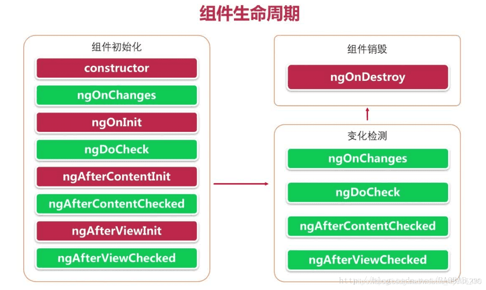

# 组件
组件是Angular应用的主要构建块。

### 创建
使用命令行创建
```sh
ng generate component <component-name>
ng generate component <dir>/<component-name>
```

### 目录
|- <component-name>
|-----  <component-name>.component.html
|-----  <component-name>.component.ts
|-----  <component-name>.component.spec.ts
|-----  <component-name>.component.css

### 结构
- HTML模板：描述组件的结构，并渲染在页面
- 样式文件：定义展示样式
- 行为类：管理组件的数据和行为
- 测试类：对组件进行单测

### 声明
装饰器@Component用声明一个类是一个组件。
```ts
@Component({
	selector: 'app-demo', // 组件唯一ID，也是其他模板使用的标签名
	templateUrl: './demo.component.html', // 模板位置
	styleUrls:['./demo.component.css'] // 样式文件位置
	template: '<h1>Hello World!</h1>', // 也可以直接定义模板，templateUrl和template两个必须有一个，但不能同时都有
  styles: ['h1 { font-weight: normal; }'] // 或者直接写样式
})
class DemoComponent{}
```

### 生命周期

Angular通过实现不同的生命周期接口来实现不同生命周期函数的响应，每个接口都定义了一个单独的钩子方法的原型，其名称是接口名称前缀为ng。这样可以实现按需加载不同的生命周期函数。



```ts
import { AfterContentChecked, AfterContentInit, AfterViewChecked, AfterViewInit, Component, DoCheck, OnChanges, OnDestroy, OnInit, SimpleChanges } from '@angular/core';

@Comonent({...})
class DemoComponent implements OnChanges, OnInit, DoCheck, AfterContentInit, AfterContentChecked, AfterViewInit, AfterViewChecked, OnDestroy {	 
	constructor() {}
	ngOnChanges(changes: SimpleChanges): void {}
	ngOnInit(): void {}
	ngDoCheck(): void {}
	ngAfterContentInit(): void {}
	ngAfterContentChecked(): void {}
	ngAfterViewInit(): void {}
	ngAfterViewChecked(): void {}
	ngOnDestroy(): void {}
}

```

### 视图封装
在NG中，组件样式是被封装到宿主节点上，不会影响应用的其他部分。@Component()提供了encapsulation进行封装模式配置。主要有三种封装模式。

```ts
@Component({
	encapsulation: ViewEncapsulation.None
})
```

- None：不对组件的的CSS选择器进行封装，样式会变成全局适用，对其他组件可能会有影响
- Emulate：通过NG封装组件CSS选择器来只适配组件的视图，达到不影响其他组件
- ShadowDom：使用浏览器内置的Shadow DOM API进行封装

### 组件交互

**输入属性**
使用装饰器@Input()修饰，可以设置别名。
```ts
class ChildComponent{
	@Input() id = 0;
	@Input("value") name = "";
}

// parent.component.html
<app-demo [id]="123" [name]="test"></app-demo>
```

**输出属性**
使用装饰器@Output()修饰，一般用于事件回调。
```ts
// child.component.ts
class ChildComponent{
	@Output onChange = new EventEmitter<string>();

	change(value: string){
		this.onChange.emit(value);
	}
}

// child.component.html
<button (click)="change('name')"></button>

// parent.component.html
<app-demo (onChange)="handleChange($event)"></app-demo>
```

**本地变量**
在html模板里面使用#声明本地变量，本地变量一般为子组件的引用，作用范围在模板内。
```ts
<app-countdown-timer #timer></app-countdown-timer>
<button (click)="timer.start()">Start</button>
```

**子组件引用**
使用装饰器@ViewChild()修饰，传入子组件类型，获取到该类型的子组件引用。如果拥有多个相同类型的子组件，默认获取第一个。
```ts
class ParentComonent{
	@ViewChild(ChildComponent)
	private child!: ChildComponent;

	test(){
		this.child.test();
	}
}
```

**使用服务交互**
可以在行为内使用订阅模式进行交互。
```ts
// demo.service.ts
@Injectable()
class DemoService{
	private messageSource = new Subject<string>();

	message$ = this.messageSource.asObservable();

	send(msg: string){
		this.messageSource.next(msg);
	}
}

// server.component.ts
class ServerComponent{
	constructor(private demoService: DemoService){
		demoService.message$.subscribe(msg => {});
	}
}

// client.component.ts
class ClientComponent{
	constructor(private demoService: DemoService){
		demoService.message$.subscribe(msg => {});
	}
}
```

### 组件样式
NG应用可以使用标准的CSS，也扩展了一些自定义的。

**自定义样式的几种方式**
- 使用CSS自定义属性
- 使用@mixin混合全局CSS
- 使用Shadow DOM模式时，利用::part伪类
- 提供一个TS接口

**一些特殊的选择器**
- <:host> 定义组件的宿主节点样式
- <:host-context()> 定义指定宿主节点内的特定节点的样式

### 内容投影
内容投影就是将该节点的子元素投影到组件内容里面。投影内容主要有单子节点、多子节点和条件化内容。主要是用ng-content标签。

**单子节点**
```ts
// app.component.ts
<app-parent>
	<p>This is a parent component.</p>
</app-parent>

// parent.component.html
<h2>Parent</h2>
<ng-content></ng-content> // <p>This is a parent component.</p>
```

**多子节点**
多子节点默认选择最后一个子节点投影。也可以用select属性来选择需要展示的内容。
```ts
// app.component.ts
<app-parent>
	<p where>Where is the parent component?</p>
	<p>This is a parent component.</p>
</app-parent>

// parent.component.html
<h2>Parent</h2>
<ng-content></ng-content> // <p>This is a parent component.</p>
<ng-content select="[where]"></ng-content> // <p where>Where is the parent component?</p>
```

**条件化内容**
使用ng-template来投影带条件渲染的内容，或者多次渲染。
```ts
// 1. 定一个指令
// conditional-project.directive.ts
@Directive({
  selector: '[appConditionalProjectionDirective]'
})
export class ZippyContentDirective {
  constructor(public templateRef: TemplateRef<unknown>) {}
}

// 2. 组件内获取指令内容
// app.component.ts
@ContentChild(ConditionalProjectionDirective) content!: ConditionalProjectionDirective;

// 3. 使用ng-container获取投影内容
// content.component.html
<div *ngIf="expanded" [id]="contentId">
    <ng-container [ngTemplateOutlet]="content.templateRef"></ng-container>
</div>

// 4. 使用ng-template进行内容投影
// app.component.html
<ng-template appConditionalProjectionDirective>
  It depends on what you do with it.
</ng-template>
```

### 动态组件
通过指令的**ViewContainerRef**来进行内容清理和组件重填。
