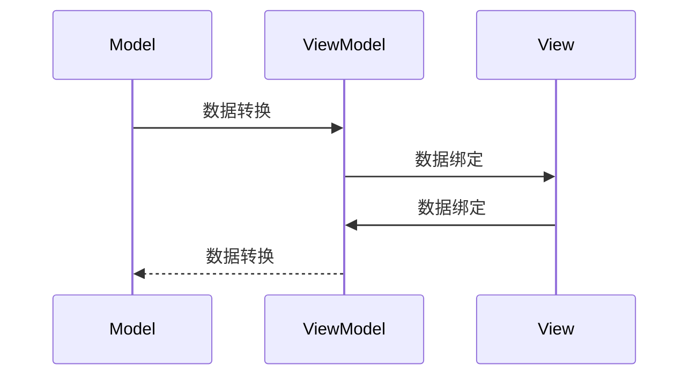
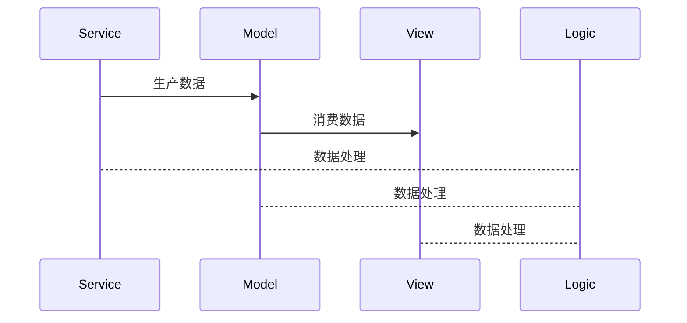
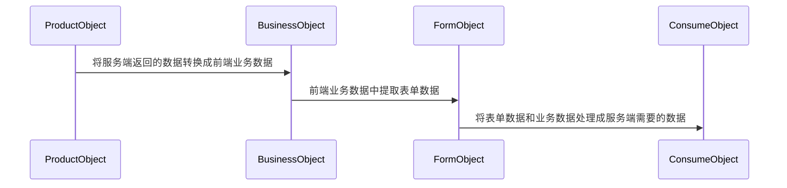

# React框架下的数据驱动与模型设计

## 数据驱动

数据驱动是通过建立数据模型去描述业务和功能的一种模式，旨在通过对数据模型的解读就可以实现对业务和功能的了解。在数据驱动模式下我们可以把核心关注转移到数据模型身上，通过对数据模型的操作来实现业务。

## MVVM（Model-View-ViewModel）

MVVM模式是数据驱动中的一种特殊实现，主要应用于前端框架，典型框架是Angular、Vue等。将逻辑与视图分离开来管理，并通过数据驱动来联系。该模式在视图与模型之间设立了一个中间模型，即视图模型，视图模型负责处理视图消费的数据和收集视图生成的数据，该数据基本上是实现了双向绑定。

## 数据流向与业务分层

一般在数据流向中会出现4个角色：数据生产者、数据处理者、数据存储者以及数据消费者，针对这四个不同的角色会设计4个不同的业务层级，分别是服务层(Sevice)、逻辑层(Logic)、模型层(Model)、视图层(View)。并且在不同的数据流向中，某些层级的角色会发生变化。服务层主要对服务端进行数据获取和推送，逻辑层负责数据处理与转换，模型层负责存储数据，视图层负责消费数据和生产数据。

#### 从服务端获取数据并进行展示

此流向中服务层作为生产者，而视图是消费者。

#### 从前端获取数据并进行存储

此流向中服务层为消费者，而视图是生产者。

这种设计方案一般适用于业务性模块。而实际开发中并不严格按照这种设计方式来组织。

## React状态管理

React框架只是一个简单的UI构建库，并没有提供自身的状态管理工具，并且数据流向是在组件树上是单向流动，没有提供数据双向绑定，这导致开发者需要自己去设计状态管理，常用的状态管理工具有Redux、Mobx等。

状态管理一般区分为全局状态管理和组件状态管理， 全局状态管理主要多个组件将状态委托到一个状态容器进行统一管理，这也导致了全局状态管理一般来说属于单例模式，会带来一些额外开销，比如状态重置，状态冗余等等。全局状态也分级别，主要分为应用、模块、页面等级别，不同级别的全局状态处理不同级别的事务，这样可以更好的降低刷新成本。组件状态管理主要是组件管理自己的状态，一般来说，拥有状态的组件都是层级非常低的组件，例如UI组件、原子级业务组件等，组件的状态会随着组件销毁而销毁。从某种视角来看，一些局部的全局状态管理也可以归为组件状态管理，例如由多个原子组件构成的复杂组件。

模型层负责数据，视图层的展示是根据模型层的数据进行渲染，因此这个也成为了状态层，负责状态管理。

## Form的对象设计

在一个较为复杂的表单业务设计中，我一般会设计4个对象，来自服务端数据的生产对象，接着就是前端业务对象，再下来就是表单对象，最后是发生给服务端的消费对象。

#### 生产对象

也就是生产者的数据，主要来源于服务端，对服务端数据进行处理，包括数据类型校验、数据安全性检测、数据默认值等，处理完成后就得到业务需要的数据源。

#### 业务对象

根据业务信息、交互信息、视觉信息等信息整合而成的就是业务对象。

#### 表单对象

将表单项整合而成的对象，对象的数据来源生产对象和业务对象。

#### 消费对象

将业务对象和表单对象进行提炼消费对象，然后交给服务端去处理和存储。