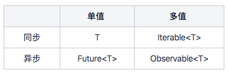
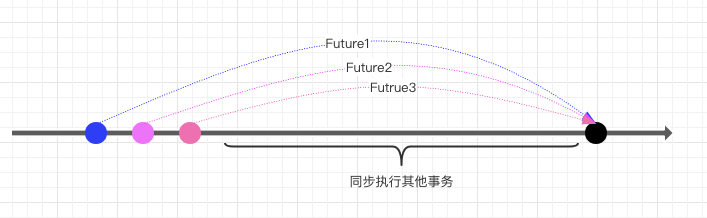
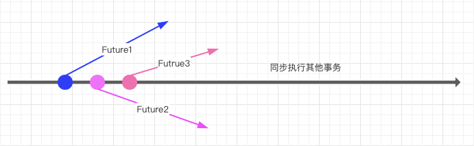
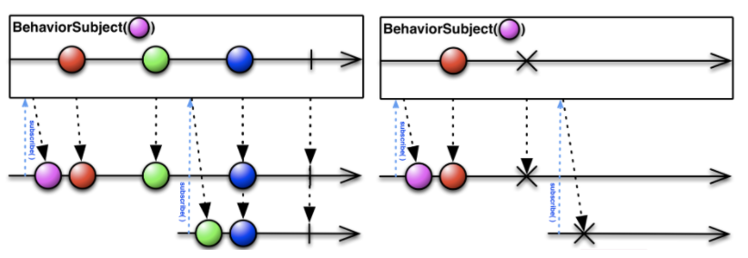
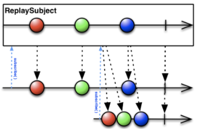
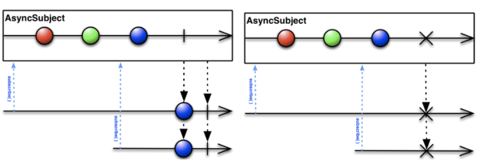

# Rx浅析
## 数据流


**异步数据流之阻塞式**


这种异步数据流体现的是数据计算过程的非阻塞，但是使用结果的时候需要阻塞。
```java
public static void main(String[] args){
	FutureTask future1 = new FutureTask(compute1)
	FutureTask future2 = new FutureTask(compute2)
	FutureTask future3 = new FutureTask(compute3)
	// *****************
	// do other someting
  // ***************** 
	if(future1.isDone() && future2.isDone() && future3.isDone()){
		// todos
	}
}
```

**异步数据流之非阻塞式**


在基于事件机制的编程语言里面，基本采用这种非阻塞式，每一个异步计算相当于新开了一个时间线。
```javascript
// 一旦发起异步操作后就再也回不到该时间线
// 单个异步操作
fetch(‘/future1’).then(future1)
fetch(‘/future2’).then(future2)
fecth(‘/future3’).then(future2)

// do some things and completed

```

## 观察者模式
在观察者模式中，一个目标对象管理所有依赖于它的观察者对象，并且在它本身的状态发生变化时在主动发出通知，观察者之间没有任何联系。
该模式通常被用来实时事件处理系统。

### 主要类别
```typescript
// 观察者类别/订阅者
interface Observer{
	update(value: any)
	subscribe(subject: Subject)
}
// 目标类别/发布者
interface Subject{
	attach(observer: Observer)
	detach(observer: Observer)
	notify(value: any)
}

// 常规模式
let observer = new Observer()
let subject = new Subject()
subject.attach(observer)
subject.notify(‘event’)

// 控制反转
let news = new Subject()
let citizen = new Observer()
citizen.subscribe(news)
news.notify(“a news“)
```

### 分析
- 一个目标可以被多个观察者观察，但是常规下观察者本身并不知道目标是谁，这时候需要控制反转。
- 实现表示层和数据逻辑层的分离，并定义了稳定的消息更新传递机制，对目标和观察者之间进行了解耦。

## ReactiveX
ReactiveX是一个库，用于通过使用可观察的序列来组成异步和基于事件的程序。

- RX扩展了观察者模式，数据获取方式由传统的**拉取(pull)**转成了**推送(push)**的方式
- RX解决了包括低级线程、同步、线程安全、并发数据结构和非阻塞IO等问题
- RX具备函数式和响应式编程的能力，但不同于常规的FRP

> One main point of difference is that functional reactive programming operates on values that change *continuously* over time, while ReactiveX operates on *discrete* values that are emitted over time.

### Observable（被观察者）
Observable是一组数据序列的**生产者(Producer)**，并可以这些数据推送给**Observer（观察者）**，又名**消费者(Consumer)**。
在实际应用中，可以把Observable当作一个数据池来使用。

- 可以生产无限数据，或者不生成数据
- 支持数据延迟计算
- 一个Observable只能被同时被一个Observer订阅

```javascript
// 创建Observable
// 传入的参数可以理解为Observable的数据执行函数，函数的第一个参数称作数据执行器，负责推送数据
let observable = new Observable(excutor => {
	try{
		excutor.next(1)
		// complete执行调用后，执行器不可以继续执行，观察过程也会结束
		excutor.complete()
	}catch(e){
		excutor.error()
	}
})

// 在官方文档上，这里用的是订阅函数这个概念，传入参数被命名为subscriber(订阅者)
// 我觉得在这里使用订阅函数概念并不是很直观，被观察者管理的是数据
// 如果理解生产订阅者需要的数据的函数，那么用subscriber就容易理解了
// subscriber在关联上也可以跟后面的observer对应上，可以把他们理解成同一个东西
// 这样subscriber.next就可以对应observer.next这个监听方法
new Observable(subscriber => {})

// 订阅Observable，传入的Observer可以是一个对象也可以是一个函数
let observer = {
	next: x => console.log(x),
	complete: () => console.log(‘complete’),
	error: () => console.log(‘error’)
}
// 函数式observer
// let observer = x => console.log(x)
let subscription = observable.subscribe(observer)

// 常规方式取消订阅
subscription.unsubscribe()
// 如果执行函数返回一个自定义销毁函数，订阅对象会变成那个返回函数
subscription()
```

### Subject
在RX里面，Subject既可以是Observable，又可以是observer。Subject提供了广播的功能，实现一对多的推送系统。
这样一个双重角色在实际应用中是非常有用的，这样可以剥离观察者和被观察者，通过代理的形式进行任意重组。
Subject不同于Observable的地方就是数据处理由内部转移到外部。

```javascript
// Subject作为Observable
let subject = new Subject()
// 添加两个观察者
subject.subscribe(x => console.log(‘ObserverA:’, x))
subject.subscribe(x => console.log(‘ObserverB:’, x))
// 数据推送
subject.next(1)
subject.next(2)

// output:
// ObserverA: 1
// ObserverB: 1
// ObserverA: 2
// ObserverB: 2

// Subject作为Observer，这时候Subject可以被认为是一个代理，桥接subject的observer与observable
let observable = new Observable(producer => {
	// 生产数据
	producer.next(‘a’)
	producer.next(‘b’)
})
// 这里订阅上面创建的subject
observable.subscribe(subject)

// output:
// ObserverA: a
// ObserverB: a
// ObserverA: b
// ObserverB: b
```

#### BehaviorSubject
在BehaviorSubject中有一个当前值(current value)这个概念，在初始化的时候，需要传入一个初始值作为当前，当观察者在订阅的时候会把当前值即时推送过来。如果当前观察过程结束，被订阅时则不会推送任何信息。



#### ReplaySubject
ReplaySubject提供了获取数据的范围的能力，在创建的时候传入buffer的大小，每次订阅的时候会将buffer里面的数据推送给观察者。同时还可以设置世界范围，推送时间范围内buffer的数据。


```javascript
// 不带时间范围，取最后两个
let subjectWithoutTime = new ReplaySuject(2)
subjectWithoutTime.next(1)
subjectWithoutTime.next(2)
subjectWithoutTime.next(3)
subjectWithoutTime.subscribe(v => console.log(‘without time’, v))
// output:
// without time 2
// without time 3

// 带时间范围，取最后两个，时间单位为毫秒，时间范围取订阅的时间向后偏移指定的毫秒数
let subject = new ReplaySuject(2, 300)
subject.subscribe(v => console.log(‘observerA’, v))

let i = 1
let timer = setInterval(()=>{
	let v = ++i
	console.log(‘**pus**’)
	subject.next(i)
	if(v > 5) clearInterval(timer)
}, 100)

setTimeout(() => {
  subject.subscribe(v => console.log(‘observerB’, v))
}, 500)

// output:
// **push**
// observerA 1
// **push**
// observerA 2
// **push**
// observerA 3
// **push**
// observerA 4
// observerB 3
// observerB 4
// **push**
// observerA 5
// observerB 5
```

#### AsyncSubject
AsyncSubject是具有同步性质，观察者在订阅后如果观察过程没有结束不接收任何推送，等观察过程结束后，推送最后一个值。



### Operator

算子可以对Observable进行操作，在不同的语言，算子的实现是不一样的，主要分为链式和函数式两种。

算子主要分为两大类**生成算子(Creation Operator)**和**管道算子(Pipeable Operator)**，生成算子主要是快捷的创建一个Observable；管道算子主要操作被观察的数据。在函数式中算子会传入一个Observable，然后返回一个新的Observable，原Observable不会修改，这个算子是一个纯函数。在链式结构中管道算子是Observable的一个方法。

在管道中，可以传入多个管道算子，传入的算子不会立即进行计算，只有当订阅的时候才会进行计算。

#### 算子分类
- Creating Operator：生成一个新的Obervable
- Transforming Operator：转换Observable推送的每个值
- Filtering Operator：过滤Observable推送的值
- Combining Operator：将多个Observable合并成一个
- Error Handling Operator：处理Observable抛出的异常
- Utility Operator：一些有用的处理Observable的功能算子
- Condition and Boolean Operator：处理单个或多个Observable推送的值，对其进行条件判断
- Mathematical and Aggregate Operator：对Observable推送的值进行数学计算

RX主要的分类，在各平台分类略有不同，而且算子实现的数量也不一致，具体遵循各平台自己的实现，Rx提供了庞大的算子库。具体的算子实现参考各平台的API文档。

```javascript
interval(1000) // 每1s推送一次，值从0递增
    .pipe(
        map(x => x + 1), // 每个数都加1
        filter(x => x % 2 === 0), // 过滤掉奇数
        buffer(interval(3000)) // 将3s内的值储存在数组里
    )
    .subscribe(log(‘buffer’))
```

### Scheduler
调度器控制何时开始订阅以及何时传递通知。可以定义可观察对象将在哪些执行上下文中向其观察者传递通知。

调度器的三个部件：
- 数据结构：存储数据，以及根据指定条件进行任务排序
- 执行上下文环境：提供了任务执行的时间和位置
- 虚拟时钟：保证了特定任务不受物理时间的乱序影响

#### 主要的几种调度器

- queueScheduler
- asapScheduler
- asyncScheduler
- animationFramerSchduler

