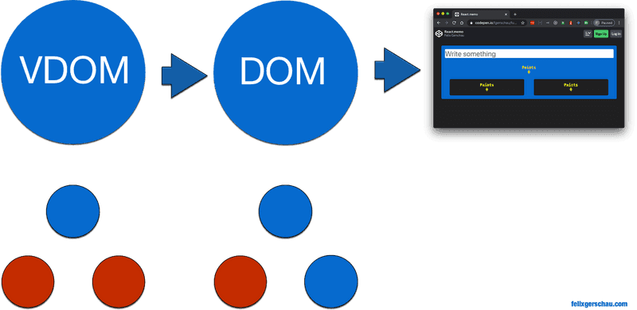
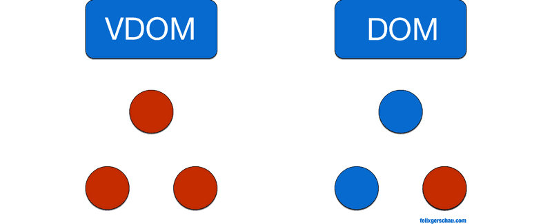

# React 什么时候重新渲染组件？

> 原文地址：[When does React re-render components?](https://felixgerschau.com/react-rerender-components/)

React 仅通过更新已更改的 UI 部分来提供快速的用户体验而闻名。

在研究 React 的渲染性能时，有一些术语和概念可能难以理解。在相当长的一段时间内，我并不是 100% 清楚 VDOM 是什么，或者 React 如何决定重新渲染组件。

在本文的第一部分，我将解释 **React 中渲染的最重要概念，**以及 **React 如何决定重新渲染给定组件**。

在本文的最后一节中，我将向您展示如何**优化 React 应用程序的渲染性能**。

如果在阅读本文后，您有未解决的问题或发现错误，请随时发表评论或给我发电子邮件。

## 在 React 中渲染

### 什么是渲染？

如果我们想了解 React 渲染和重新渲染的工作原理，最好了解库幕后发生的事情。

***渲染***是一个可以在不同抽象层次上理解的术语。根据上下文，它的含义略有不同。无论如何，最终，**它描述了生成图像的过程**。

首先，我们需要了解 DOM（文档对象模型）是什么：

>   *"The W3C Document Object Model (DOM) is a platform and language-neutral interface that allows programs and scripts to dynamically access and update the content, structure, and style of a document."*

简而言之，当你打开一个网站时，**DOM 通过标记语言 HTML 在你的屏幕上呈现出你所看见的内容**。

浏览器允许 JavaScript 语言通过 API 修改 DOM：全局可用`document`表示 HTML DOM 的状态，并为我们提供修改它的函数。

您可以通过包含函数的 DOM 编程接口使用 JavaScript 修改 DOM `document.write`，`Node.appendChild`或`Element.setAttribute`.

### 什么是 VDOM？

然后我们有 React 的**虚拟 DOM**（或 VDOM），在此之上的另一个抽象层。它由您的 React 应用程序的元素组成。

应用程序中的状态更改将首先应用于 VDOM。如果 VDOM 的新状态需要 UI 更改，*ReactDOM* 库将通过尝试仅更新*需要*更新的内容来有效地做到这一点。

例如，如果只有一个元素的属性发生变化，React 只会通过调用`document.setAttribute`（或类似的方式）来更新 HTML 元素的属性。



<center style="color: #aaa;width:800px;">其中，红点代表 DOM 树的更新。并且更新 VDOM 并不一定会触发真实 DOM 的更新。</center>

当 VDOM 更新时，React 会将其与 VDOM 的先前 ***快照*** 进行比较，然后仅更新真实 DOM 中发生变化的内容。如果没有任何改变，那么真正的 DOM 根本不会更新。 **将旧 VDOM 与新 VDOM 进行比较的过程称为 *diffing***。

真正的 DOM 更新很慢，因为它们会导致 UI 的实际重绘。React 通过更新真实 DOM 中尽可能少的数量来提高效率。

**因此，我们必须注意本地和虚拟 DOM 更新之间的区别。**

>   在 React 的关于 [reconciliation ](https://reactjs.org/docs/reconciliation.html) 的文档中阅读更多关于它是如何工作的。

### 这对性能意味着什么？

当我们谈论 React 中的渲染时，我们真正谈论的是**渲染函数的执行，但不是每次执行都会去更新 UI**。

让我们看一个例子：

```jsx
const App = () => {
  const [message, setMessage] = React.useState('');
  return (
    <>
      <Tile message={message} />
      <Tile />
    </>
  );
};
```

<center style="color: #aaa;">在函数组件中，整个函数的执行相当于类组件中的渲染函数。<center>


当父组件（在本例中为`App`）中的状态发生变化时，这两个`Tile`组件将会重新执行，即使第二个组件甚至没有收到任何参数。

这意味着该函数被调用了 3 次，但实际的 DOM 修改只在显示消息`render`的组件中发生一次：`Tile`



<center style="color:#aaa;width:800px;">红点再次代表渲染。</center>

<center style="color:#aaa;width:800px;">在 React 中，这意味着调用渲染函数。在真实的 DOM 中，这意味着重新绘制 UI。</center>

好消息是：不必过多担心 UI 重绘的性能瓶颈，因为 React 已经做了优化。

坏消息是：**左侧所有这些红点表示这些组件的渲染功能已执行。**

这些渲染函数的执行有两个缺点：

1.  React 必须在每个组件上运行它的 diff 算法来检查它是否应该更新 UI。
2.  这些渲染函数或函数组件中的所有代码都将再次执行。

第一点可以说不是那么重要，因为 React 能够非常有效地计算差异。危险在于您编写的代码在每次 React 渲染时都会**重复执行。**

在上面的例子中，我们有一个小的组件树。但是想象一下如果每个节点都有更多的子节点会发生什么，而这些子节点又可能有子组件。我们将看到如何优化它。

### 想看到重新渲染的效果吗？

React DevTools 允许在 *Components* -> *View Settings* -> *Highlight updates when components render *下突出显示渲染。开启后就可以看到 React 的**虚拟渲染**。

如果你想查看**原生重新渲染**，可以在 Chrome DevTools 中，在右侧的三点菜单 -> *More tools* -> *Rendering* -> *Paint flashing*下进行。

现在点击应用程序，首先突出显示 React 重新渲染，然后是原生渲染，**就会看到 React 优化了原生渲染**的程度。

## React 什么时候重新渲染？

上面我们看到了导致重新绘制 UI 的原因，但是从什么开始调用 React 的渲染函数呢？

每次**组件状态**发生变化时， React都会***安排(Scheduling)***一次渲染。

**安排**渲染意味着这不会立即发生。React 将尝试为此找到最佳时机。

改变**状态**意味着当我们调用`setState`函数时 React 会触发更新（在 React 钩子中，你会使用`useState`）。这不仅意味着组件的 render 函数将被调用，而且其**所有后续子组件都将重新渲染，无论它们的 props 是否已更改**。

如果您的应用程序结构不佳，您可能会运行比预期更多的 JavaScript，因为更新父节点意味着运行**所有子**`render`节点的函数。

在文章的最后一部分，我们将看到一些技巧来帮助您**防止**这种开销。

### 为什么我的 React 组件在其 props 更改时不更新？

即使组件的 props 已更改，React 也可能不会更新组件的常见原因有两个：

1.  道具没有通过正确更新`setState`
2.  对道具的引用保持不变

`setState`正如我们之前已经看到的，当您调用函数以更改状态（或函数组件中的`useState`钩子提供的函数）时，React 会重新渲染组件。

因此，子组件仅在父组件的状态随**这些功能之一**发生变化时才会更新。

**不允许直接改变 props 对象，**因为这不会触发任何更改，并且 React 不会注意到这些更改。

```javascript
this.props.user.name = 'Felix';
```

不要这样做！

您需要更改父组件中的状态，而不是像这样更改道具。

```javascript
const Parent = () => {
  const [user, setUser] = React.useState({ name: 'Felix' });  const handleInput = (e) => {
    e.preventDefault();
    setUser({      ...user,      name: e.target.value,    });  };

  return (
    <>
      <input onChange={handleInput} value={user.name} />
      <Child user={user} />
    </>
  );
};

const Child = ({ user }) => (
   <h1>{user.name}</h1>
);
```

使用相应的 React 函数更改状态很重要。你可以在[这里找到 Codepen](https://codepen.io/fgerschau/pen/MWybNbY)。

请注意我如何使用 更新状态`setUser`，这是我从中获得的功能`React.useState`。在类组件中与 this 等效的是`this.setState`.

## 强制 React 组件重新渲染

在我专业使用 React 的两年中，我从来没有到需要强制重新渲染的地步。我鼓励你从头开始阅读这篇文章，如果这就是你来这里的目的，因为通常有更好的方法来处理没有更新的 React 组件。

但是，如果您绝对需要强制更新，您可以使用以下方法执行此操作：

### 使用 React 的`forceUpdate`函数

这个是最明显的一个。在 React 类组件中，您可以通过调用此函数来强制重新渲染：

```javascript
this.forceUpdate();
```

### 在 React 钩子中强制更新

在 React 挂钩中，该`forceUpdate`功能不可用。您可以强制更新*而不*更改组件状态，`React.useState`如下所示：

```javascript
const [state, updateState] = React.useState();
const forceUpdate = React.useCallback(() => updateState({}), []);
```

我从[StackOverflow](https://stackoverflow.com/a/53215514/5503856)得到了这个。你可能永远不需要它。

## 如何优化重新渲染

低效重新渲染的一个例子是父组件控制子组件的状态。请记住：当组件的状态发生变化时，所有子组件都会重新渲染。

我扩展了我已经用来[解释 React.memo](https://felixgerschau.com/react-performance-react-memo/)的示例，使其具有更多嵌套的子项。来试试吧。

黄色的数字是计算`render`每个组件的功能被执行的次数：


#### 油漆 0

没有备忘录

#### 油漆 0

没有备忘录

#### 油漆 0

没有备忘录

#### 油漆 0

[在codepen](https://codepen.io/fgerschau/pen/wvKdrdM)上玩弄源代码。

尽管我们只更新了蓝色组件的状态，但已经触发了更多其他组件的渲染。

### 控制组件何时更新

React 为我们提供了一些功能来防止这些不必要的更新。

让我们来看看它们，在此之后，我将向您展示另一种更有效的提高渲染性能的方法。

##### 反应备忘录

第一个，我之前已经放弃了，是`React.memo`。我已经写了一篇更深入的文章，但总而言之，它是一个**防止你的 React Hook 组件在 props 不变时渲染的**功能。

一个实际的示例如下所示：

```jsx
const TileMemo = React.memo(({ children }) => {  let updates = React.useRef(0);
  return (
    <div className="black-tile">
      Memo
      <Updates updates={updates.current++} />
      {children}
    </div>
  );
});
```

在生产中使用它之前，您还需要了解一些更多的事情。我建议你在阅读完这篇文章后查看我[关于 React.memo 的文章](https://felixgerschau.com/react-performance-react-memo/)。

React 类的等价物是使用`React.PureComponent`.

##### 应该组件更新

这个函数是 React 的生命周期函数之一，它允许我们通过告诉 React 何时更新类组件来优化渲染性能。

它的参数是组件即将渲染的下一个 props 和下一个状态：

```javascript
shouldComponentUpdate(nextProps, nextState) {
  // return true or false
}
```

这个函数很容易使用：返回`true`导致 React 调用渲染函数，返回`false`阻止了这个。

##### 设置关键属性

在 React 中，执行以下操作是很常见的。找出它有什么问题：

```jsx
<div>
  {
    events.map(event =>
      <Event event={event} />
    )
  }
</div>
```

这里我忘了设置`key`属性。大多数 linter 都会警告您这一点，但为什么它如此重要？

在某些情况下，React 依赖于**识别组件和优化性能**`key`的属性。

在上面的例子中，如果一个事件被添加到数组的*开头*，React 会认为第 **一个**和所有后续元素都发生了变化，并会触发这些元素的重新渲染。我们可以通过向元素添加键来防止这种情况：

```jsx
<div>
  {
    events.map(event =>
      <Event event={event} key={event.id} />    )
  }
</div>
```

尽量避免使用数组的索引作为键，并使用标识内容的东西。
键只在兄弟姐妹中必须是唯一的。

### 组件的结构

改进重新渲染的更好方法是稍微重构代码。

小心放置逻辑的位置。如果您将所有内容都放在应用程序的根组件中，`React.memo`那么世界上所有的功能都无法帮助您解决性能问题。

如果你把它放在更靠近使用数据的地方，你可能甚至不需要`React.memo`.

查看示例的优化版本并输入一些文本：


#### 油漆 0

没有备忘录

#### 油漆 0

没有备忘录

#### 油漆 0

没有备忘录

#### 油漆 0

备忘录

#### 油漆 0

备忘录

#### 油漆 0

备忘录

#### 油漆 0

您会看到，即使状态更新，**其他组件也不会重新渲染。**

我所做的唯一更改是**将处理状态的代码移动到一个单独的组件中**：

```jsx
const InputSelfHandling = () => {
  const [text, setText] = React.useState('');
  return (
    <input
      value={text}
      placeholder="Write something"
      onChange={(e) => setText(e.target.value)}
    />
  );
};
```

如果您需要在应用程序的其他部分使用状态，您可以使用 React Context 或 MobX 和 Redux 等替代方案来实现。

>   在[本文中](https://felixgerschau.com/react-component-composition/#how-can-composition-help-performance)，我将更详细地解释组件组成以及它如何帮助提高性能。

## 结论

我希望我能让你更好地理解 React 的渲染机制是如何工作的，以及你可以做些什么来充分利用它。对于这篇文章，我不得不对该主题进行一些额外的研究，以更好地理解 React 的渲染是如何工作的。

我打算写更多关于前端性能的文章，所以如果你想获得有关最新文章的通知，请在 Twitter 上关注我并订阅我的电子邮件列表。

如果你走到这一步，你还想看看[我关于 React.memo 的文章](https://felixgerschau.com/react-performance-react-memo/)，它更深入地解释了 API、你可能遇到的一些常见陷阱，以及为什么你不应该 *总是*使用 React.memo。谢谢阅读。